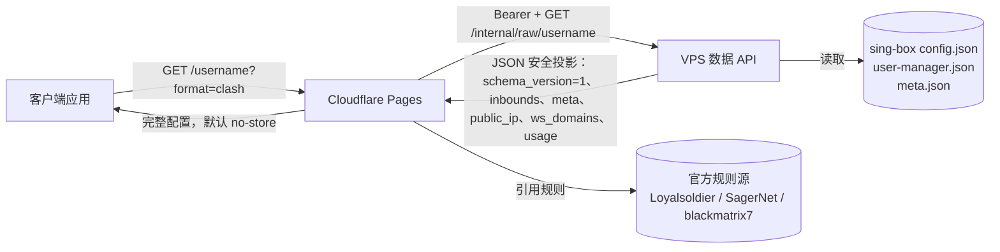

# 01 · 架构

subflow 由两个相互协作且职责边界严格的服务组成。

## 组件

### VPS 数据 API (`vps/subflow`)

这是一个仅使用 Python 标准库的轻量 HTTP 服务，与内置的 sing-box 管理器
（位于 `vps/singbox`）运行在同一台机器上。它会：

- 读取 sing-box 文件（`config.json`、`user-manager.json`、`meta.json`）；
- 使用 Bearer token 对每个请求进行身份验证，包括 `/healthz`；
- 针对单个用户名返回该用户客户端连接数据的**字段白名单 JSON 安全投影**，其中包含
  `schema_version=1`、Reality 公钥元数据以及公网 IP 和 WebSocket 域名。

它**不进行**任何协议渲染，也绝不返回服务器私钥或其他用户的密钥。

### Cloudflare Pages 网关 (`cloudflare/functions/`)

这是一个 Pages Function，它会：

- 验证 URL 路径中的用户名；
- 从 VPS 获取原始载荷；
- 规范化节点并检测协议；
- 协商输出格式（查询字符串 → User-Agent → 默认值）；
- **生成完整的客户端配置**并返回，同时默认设置 `Cache-Control: no-store`。

所有组装逻辑都位于此处，即 `cloudflare/functions/_lib/` 下的模块化文件中。

## 数据流

## 为什么在 Cloudflare 上生成配置

- VPS 保持精简：只有一个数据端点，不包含模板引擎和规则数据。
- 配置逻辑随 Pages 项目部署，迭代快速且无需 SSH。
- 规则引用自官方数据源，因此客户端始终直接获取最新版本；subflow 从不重新托管规则数据，
  也不会导致规则数据过时。

## 模块索引

| 职责 | 文件 |
| --- | --- |
| 环境变量解析（唯一数据源） | [cloudflare/functions/_lib/config.js](../cloudflare/functions/_lib/config.js) |
| 常量和官方数据源 URL | [cloudflare/functions/_lib/constants.js](../cloudflare/functions/_lib/constants.js) |
| VPS 传输 | [cloudflare/functions/_lib/raw-client.js](../cloudflare/functions/_lib/raw-client.js) |
| 协议检测和节点模型 | [cloudflare/functions/_lib/protocol.js](../cloudflare/functions/_lib/protocol.js) |
| 分享链接构建器 | [cloudflare/functions/_lib/links.js](../cloudflare/functions/_lib/links.js) |
| 格式协商 | [cloudflare/functions/_lib/format.js](../cloudflare/functions/_lib/format.js) |
| 模板缓存获取器 | [cloudflare/functions/_lib/templates/fetcher.js](../cloudflare/functions/_lib/templates/fetcher.js) |
| 各平台生成器 | [cloudflare/functions/_lib/templates/](../cloudflare/functions/_lib/templates) |
| VPS 配置 | [vps/subflow/config.py](../vps/subflow/config.py) |
| VPS 原始数据投影 | [vps/subflow/services/raw_projection.py](../vps/subflow/services/raw_projection.py) |
| VPS HTTP 处理器 | [vps/subflow/http/handlers.py](../vps/subflow/http/handlers.py) |
| 共享默认值（唯一 YAML 数据源） | [configs/defaults.yaml](../configs/defaults.yaml) |
| 内置 sing-box 管理器 | [vps/singbox/](../vps/singbox) |
