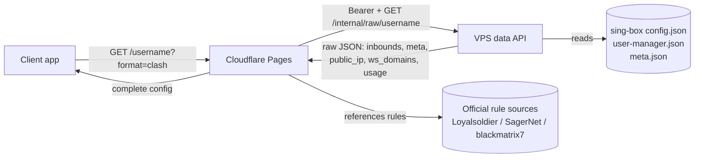

# 01 · Architecture

subflow is split into two cooperating services with a strict responsibility
boundary.

## Components

### VPS data API (`src/subflow`)

A small Python (stdlib-only) HTTP service that runs next to an existing
Tangfffyx/sing-box installation. It:

- reads the upstream files (`config.json`, `user-manager.json`, `meta.json`),
- authenticates every request with a Bearer token,
- returns, for one username, a **raw JSON slice** of just that user's inbounds
  plus the Reality metadata and the public IP / WebSocket domains.

It performs **no** protocol rendering and never returns other users' secrets.

### Cloudflare Pages gateway (`functions/`)

A Pages Function that:

- validates the username from the URL path,
- fetches the raw payload from the VPS,
- normalizes nodes and detects protocols,
- negotiates the output format (query string → User-Agent → default),
- **generates the full client configuration** and returns it.

All assembly logic lives here, in modular files under `functions/_lib/`.

## Data flow

## Why generation lives on Cloudflare

- The VPS stays minimal: one endpoint, no template engine, no rule data.
- Configuration logic deploys with the Pages project (fast iteration, no SSH).
- Rules are referenced from official sources, so clients always fetch the latest
  versions directly; subflow never re-hosts or ages rule data.

## Module map

| Concern | File |
| --- | --- |
| Env resolution (single source) | [functions/_lib/config.js](../functions/_lib/config.js) |
| Constants & official source URLs | [functions/_lib/constants.js](../functions/_lib/constants.js) |
| VPS transport | [functions/_lib/raw-client.js](../functions/_lib/raw-client.js) |
| Protocol detection & node model | [functions/_lib/protocol.js](../functions/_lib/protocol.js) |
| Share-link builders | [functions/_lib/links.js](../functions/_lib/links.js) |
| Format negotiation | [functions/_lib/format.js](../functions/_lib/format.js) |
| Template cache fetcher | [functions/_lib/templates/fetcher.js](../functions/_lib/templates/fetcher.js) |
| Per-platform generators | [functions/_lib/templates/](../functions/_lib/templates) |
| VPS config | [src/subflow/config.py](../src/subflow/config.py) |
| VPS raw projection | [src/subflow/services/raw_projection.py](../src/subflow/services/raw_projection.py) |
| VPS HTTP handlers | [src/subflow/http/handlers.py](../src/subflow/http/handlers.py) |
